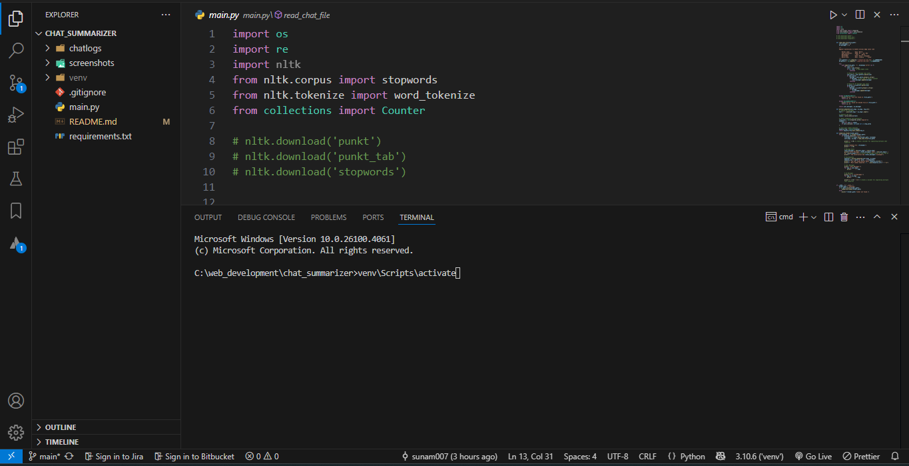
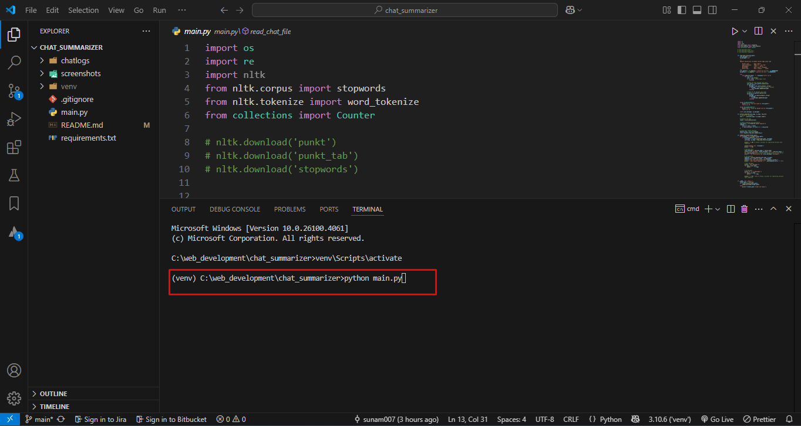
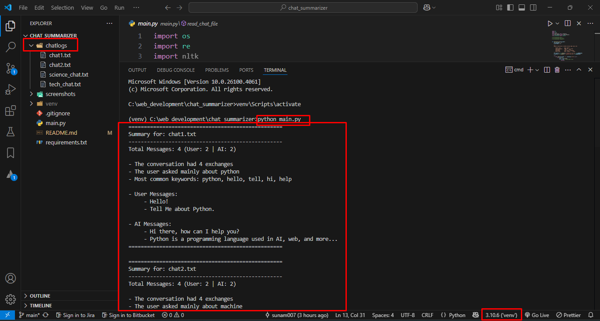
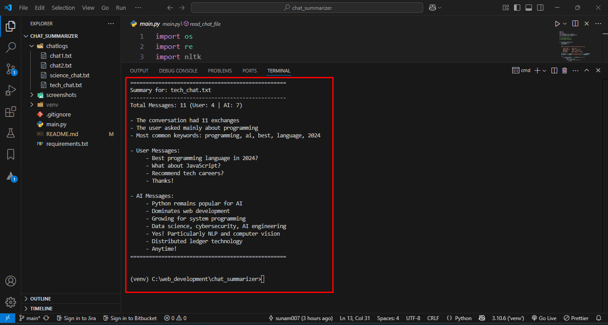

# AI Chat Log Summarizer

A Python script that analyzes chat logs between users and AI, providing message statistics and keyword insights.

## Features
✔ Parses `.txt` chat logs with flexible formatting (case/space insensitive)  
✔ Counts total messages and separates User vs AI messages  
✔ Extracts top 5 keywords (excluding stopwords)  
✔ Processes all `.txt` files in a folder  
✔ Handles edge cases (malformed lines, encoding issues)  

## Requirements
- Python 3.9+ (Tested on Python 3.10.6)
- NLTK (for text processing)

## Setup
1. Create and activate virtual environment:
   ```bash
   python -m venv venv
   venv\Scripts\activate

### Activate virtual environment


2. Install dependencies:
    ```bash
    pip install -r requirements.txt

3. Download NLTK data (first run only):
    ```bash
    python -c "import nltk; nltk.download('punkt'); nltk.download('stopwords')"

## Usage
1. place chat log files ( .txt files ) on the `chatlogs` folder

2. Run the script:
    ``` bash
    # cmd (after activating virtual environment)
    python main.py

### Run main.py


### After running the main.py file the script will summarize the chat logs

### Output sample 1


### Output sample 2
